# Network Packet Analyzer using Python and Scapy

A Python-based **Network Packet Analyzer** developed using **Scapy** on Kali Linux. The project captures live network traffic and progressively analyzes packets by identifying protocols, IP addresses, port numbers, payload information, packet numbers, and timestamps.

## ⚙️ Project Implementation

## Step 1 — Create the Project Directory

#### Objective

Create a dedicated project directory for the **Network Packet Analyzer** and navigate into it. This directory will contain the Python program and other project files.

#### 1. Open Kali Linux

Start the **Kali Linux** virtual machine in VirtualBox and log in to the system.

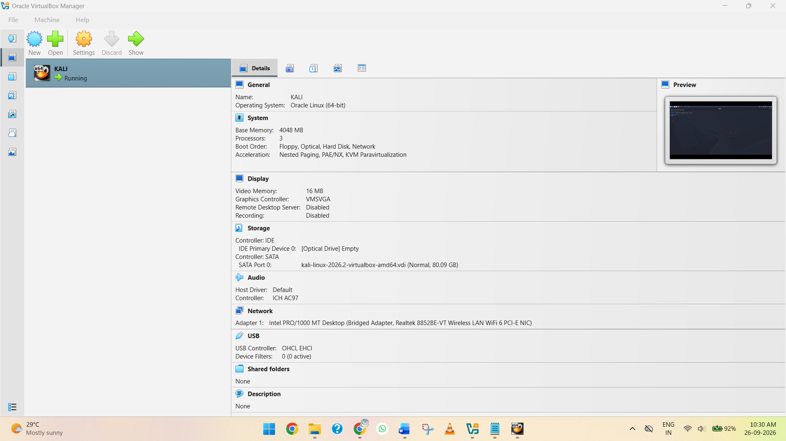

*Screenshot 1: Kali Linux running in VirtualBox.*

#### 2. Create the Project Directory

Open the Kali Linux terminal and create the project directory:

```bash
mkdir -p ~/Mini_Projects/Network_Packet_Analyzer
```

#### 3. Navigate into the Project Directory

Navigate into the newly created project directory:

```bash
cd ~/Mini_Projects/Network_Packet_Analyzer
```

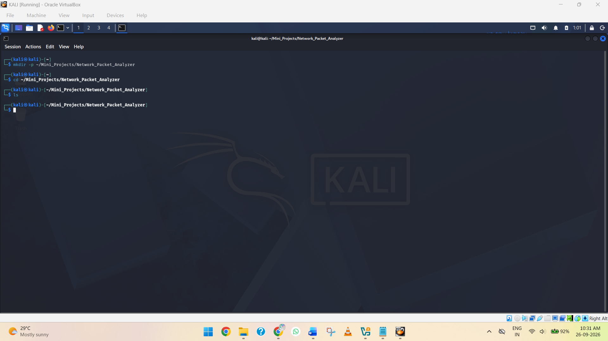

*Screenshot 2: Terminal showing the project directory creation and navigation.*

#### 4. Verify the Current Directory

Run the following command to verify the current working directory:

```bash
pwd
```

The terminal should display:

```text
/home/kali/Mini_Projects/Network_Packet_Analyzer
```


*Screenshot 3: Terminal showing the current project directory using the `pwd` command.*

---

## Step 2 — Check Python Installation

#### Objective

Verify that Python 3 is installed and working correctly on Kali Linux before developing the **Network Packet Analyzer**. Python will be used to create the packet capture and analysis program.

#### 1. Check the Python 3 Version

From inside the project directory, run:

```bash
python3 --version
```

The terminal should display the installed Python 3 version. For example:

```text
Python 3.13.7
```

The exact version may be different depending on the Kali Linux installation.


*Screenshot 4: Terminal showing the installed Python 3 version.*

#### 2. Verify the Python Executable

Run the following command to verify the location of the Python 3 executable:

```bash
which python3
```

The terminal should display a path similar to:

```text
/usr/bin/python3
```


*Screenshot 5: Terminal showing the location of the Python 3 executable.*

### Step 3 — Install and Verify Scapy

#### Objective

Install the **Scapy** Python library, which will be used to capture and analyze network packets. Scapy provides functions for working with network protocols and extracting information such as IP addresses, protocols, ports, and packet data.

#### 1. Check if Scapy Is Already Installed

From inside the project directory, run:

```bash
python3 -c "import scapy; print('Scapy is installed')"
```

If Scapy is already installed, the terminal should display:

```text
Scapy is installed
```


*Screenshot 6: Terminal showing that Scapy is already installed.*

#### 2. Install Scapy if It Is Not Installed

If the previous command shows an error such as `ModuleNotFoundError`, install Scapy using:

```bash
sudo apt update
```

Then:

```bash
sudo apt install python3-scapy -y
```

Enter your Kali Linux password when prompted.

#### 3. Verify the Scapy Installation

After installation, run:

```bash
python3 -c "from scapy.all import sniff; print('Scapy is ready for packet capture')"
```

The terminal should display:

```text
Scapy is ready for packet capture
```

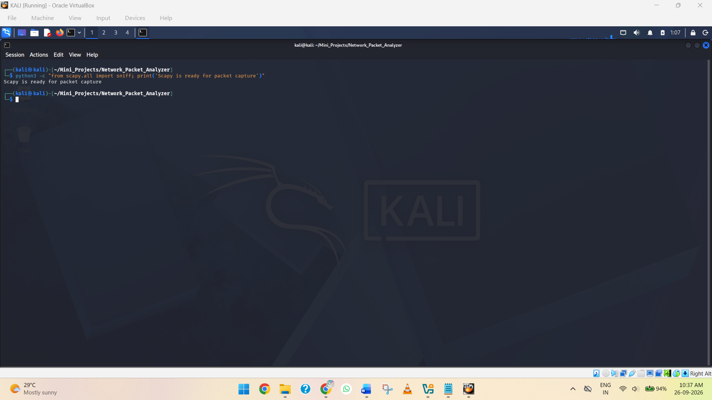

*Screenshot 7: Terminal showing successful Scapy installation and verification.*

---

### Step 4 — Create the Python Packet Analyzer File

#### Objective

Create the main Python file for the **Network Packet Analyzer**. This file will contain the code used to capture network packets and display basic packet information.

#### 1. Create the Python File

Make sure you are inside the project directory:

```bash
cd ~/Mini_Projects/Network_Packet_Analyzer
```

Create the Python file:

```bash
touch packet_analyzer.py
```

#### 2. Verify the File

Run:

```bash
ls -l
```

The terminal should display the newly created file:

```text
packet_analyzer.py
```

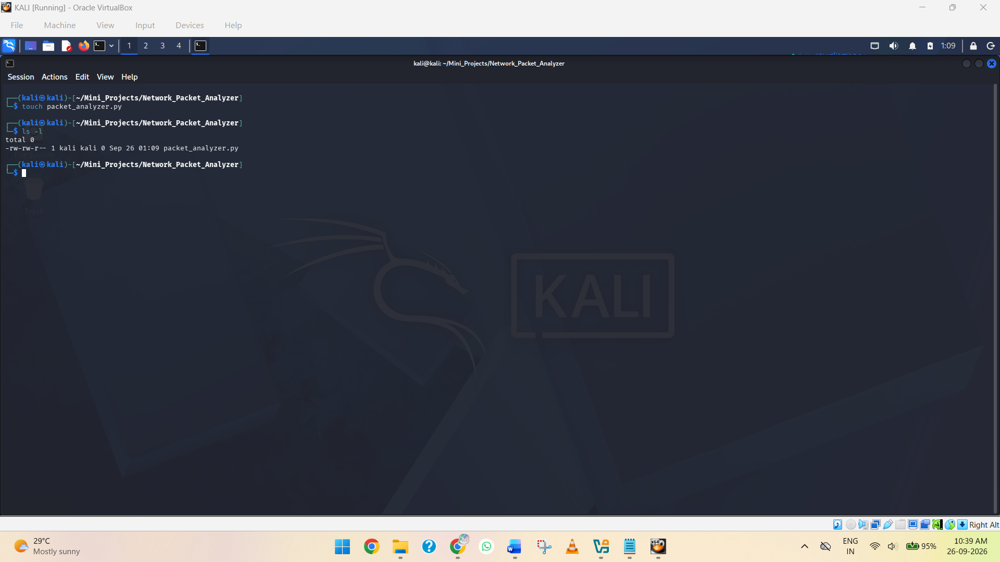

*Screenshot 8: Terminal showing the `packet_analyzer.py` file inside the project directory.*

#### 3. Open the Python File

Open the file using the Nano text editor:

```bash
nano packet_analyzer.py
```

The file will initially be empty.

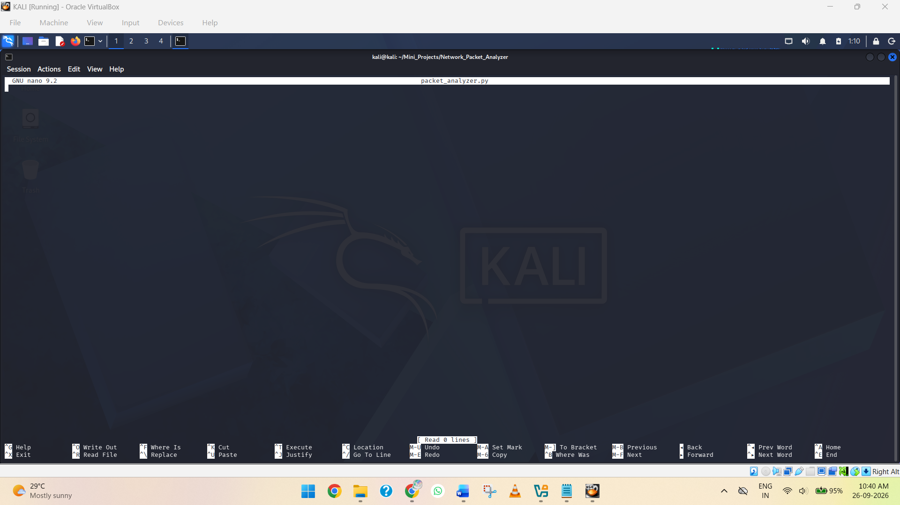

*Screenshot 9: Nano editor showing the newly created `packet_analyzer.py` file.*

---

### Step 5 — Write the Basic Packet Capture Program

#### Objective

Add the basic Python code required to capture network packets using **Scapy**. The program will display the source IP address, destination IP address, and protocol information for each captured packet.

#### 1. Open the Python File

Run:

```bash
nano packet_analyzer.py
```

#### 2. Add the Following Code

Enter the following code:

```python
from scapy.all import sniff, IP


def analyze_packet(packet):

    if IP in packet:
        source_ip = packet[IP].src
        destination_ip = packet[IP].dst
        protocol = packet[IP].proto

        print("\n--- Packet Captured ---")
        print(f"Source IP      : {source_ip}")
        print(f"Destination IP : {destination_ip}")
        print(f"Protocol       : {protocol}")


print("Starting Network Packet Analyzer...")
print("Capturing packets. Press Ctrl+C to stop.")

sniff(prn=analyze_packet, store=False)
```

#### 3. Save the Python File

In Nano:

1. Press **Ctrl + O** to save the file.
2. Press **Enter** to confirm the filename.
3. Press **Ctrl + X** to exit Nano.

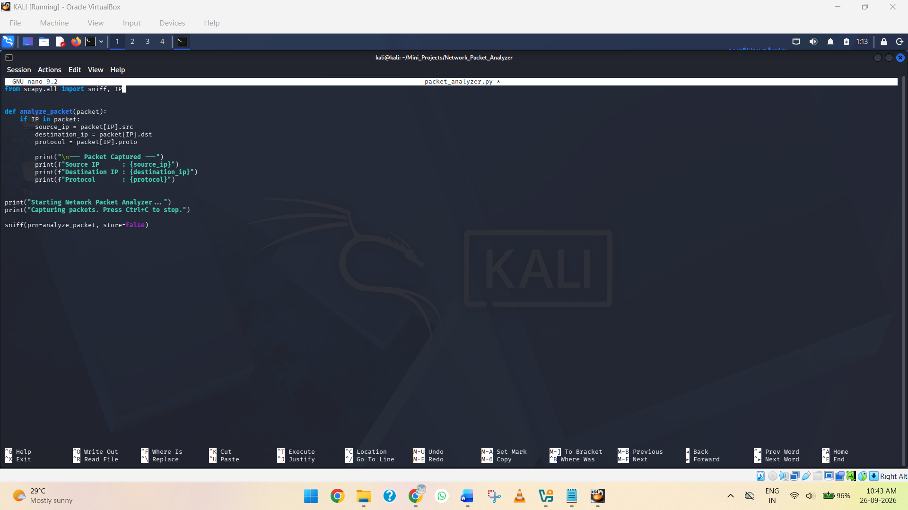

*Screenshot 10: Nano editor showing the completed basic packet capture code.*

#### What This Code Does

The program imports Scapy's `sniff()` function to capture packets.

The `analyze_packet()` function checks whether a captured packet contains an **IP layer**. If it does, the program extracts:

* **Source IP address**
* **Destination IP address**
* **IP protocol number**

The `sniff()` function continuously captures packets and sends each packet to `analyze_packet()` for analysis.

> **Important:** Only capture traffic on networks/interfaces you own or have explicit permission to monitor. For this project, use your own Kali VM/network traffic.

---

### Step 6 — Run and Test the Packet Analyzer

#### Objective

Run the **Network Packet Analyzer** and verify that it can successfully capture and display network packets. The program will show the source IP address, destination IP address, and protocol number for captured IP packets.

#### 1. Run the Packet Analyzer

From the project directory, run:

```bash
sudo python3 packet_analyzer.py
```

You should see:

```text
Starting Network Packet Analyzer...
Capturing packets. Press Ctrl+C to stop.
```

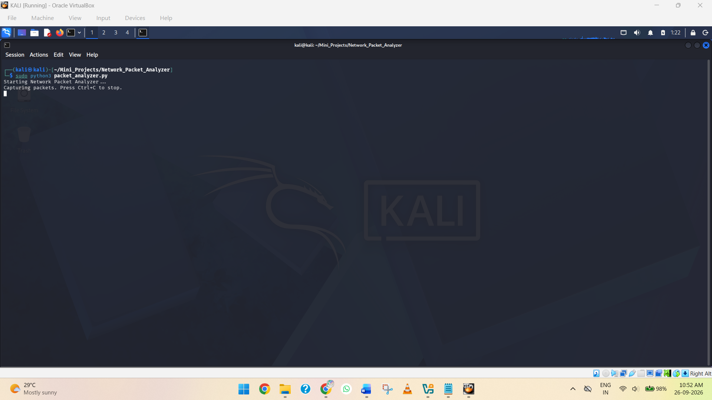

*Screenshot 11: Terminal showing the Network Packet Analyzer starting successfully and waiting for network packets.*

#### 2. Generate Some Network Traffic

While the analyzer is running, open another terminal and run:

```bash
ping -c 4 8.8.8.8
```

This generates ICMP network traffic that the packet analyzer can capture.

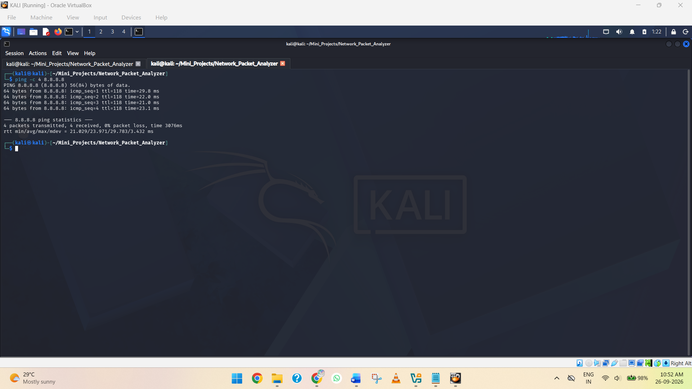

*Screenshot 12: Terminal showing the `ping` command.*

You should see packet information similar to:

```text
--- Packet Captured ---

Source IP      : 192.168.43.18
Destination IP : 8.8.8.8
Protocol       : 1
```

The actual IP addresses will depend on your network configuration.

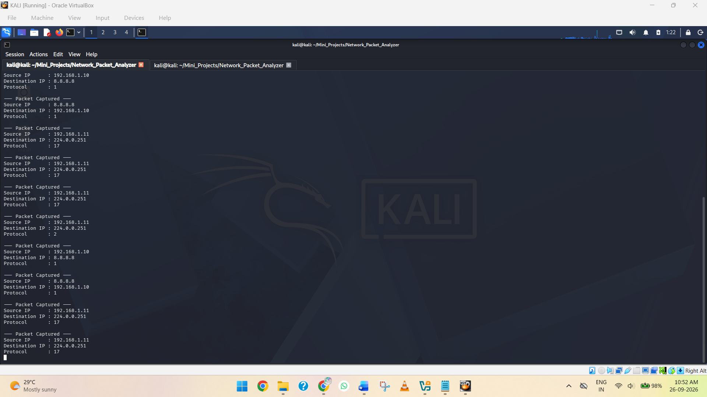

*Screenshot 13: Packet Analyzer terminal showing captured packets with source IP, destination IP, and protocol information.*

#### 3. Stop the Packet Analyzer

Return to the terminal running the analyzer and press:

```text
Ctrl + C
```

The packet capture will stop and return to the terminal prompt.

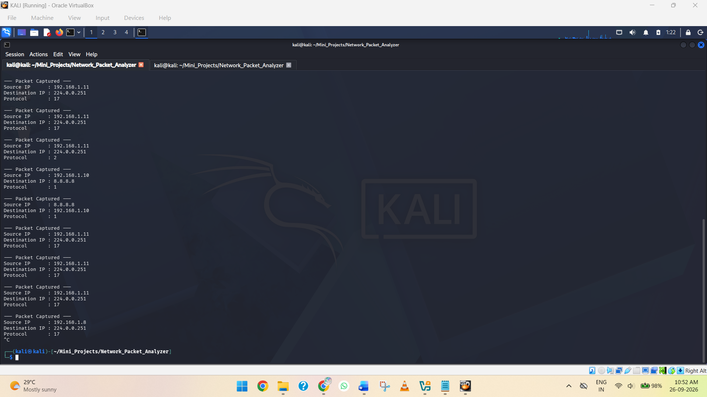

*Screenshot 14: Terminal showing the packet analyzer stopped using Ctrl+C.*

### Step 7 — Improve Packet Analysis

#### Objective

Modify the packet analyzer to display more useful network information, including the **source IP address, destination IP address, protocol, source port, and destination port**.

#### 1. Open the Python File

Run:

```bash
nano packet_analyzer.py
```

#### 2. Replace the Existing Code

Replace the previous code with:

```python
from scapy.all import sniff, IP, TCP, UDP


def analyze_packet(packet):

    if IP in packet:
        source_ip = packet[IP].src
        destination_ip = packet[IP].dst
        protocol = packet[IP].proto

        print("\n--- Packet Captured ---")
        print(f"Source IP      : {source_ip}")
        print(f"Destination IP : {destination_ip}")
        print(f"Protocol       : {protocol}")

        if TCP in packet:
            print(f"Source Port    : {packet[TCP].sport}")
            print(f"Destination Port: {packet[TCP].dport}")

        elif UDP in packet:
            print(f"Source Port    : {packet[UDP].sport}")
            print(f"Destination Port: {packet[UDP].dport}")


print("Starting Network Packet Analyzer...")
print("Capturing packets. Press Ctrl+C to stop.")

sniff(prn=analyze_packet, store=False)
```

#### 3. Save the File

In Nano:

1. Press **Ctrl + O**
2. Press **Enter**
3. Press **Ctrl + X**

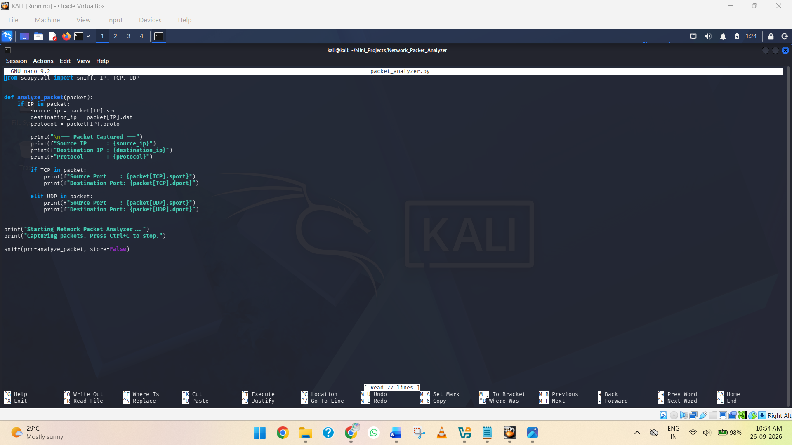

*Screenshot 15: Nano editor showing the updated packet analyzer code with TCP and UDP packet analysis.*

#### What Was Added

The program now identifies:

* **TCP packets** and displays their source and destination ports.
* **UDP packets** and displays their source and destination ports.
* **IP information** for captured packets.

This makes the analyzer more useful for basic network traffic investigation.

---

### Step 8 — Test TCP and UDP Packet Analysis

#### Objective

Test the updated **Network Packet Analyzer** by generating **TCP and UDP network traffic** and verify that the program displays the corresponding source and destination ports.

#### 1. Start the Packet Analyzer

Open the project directory:

```bash
cd ~/Mini_Projects/Network_Packet_Analyzer
```

Run the analyzer:

```bash
sudo python3 packet_analyzer.py
```

The terminal should display:

```text
Starting Network Packet Analyzer...
Capturing packets. Press Ctrl+C to stop.
```

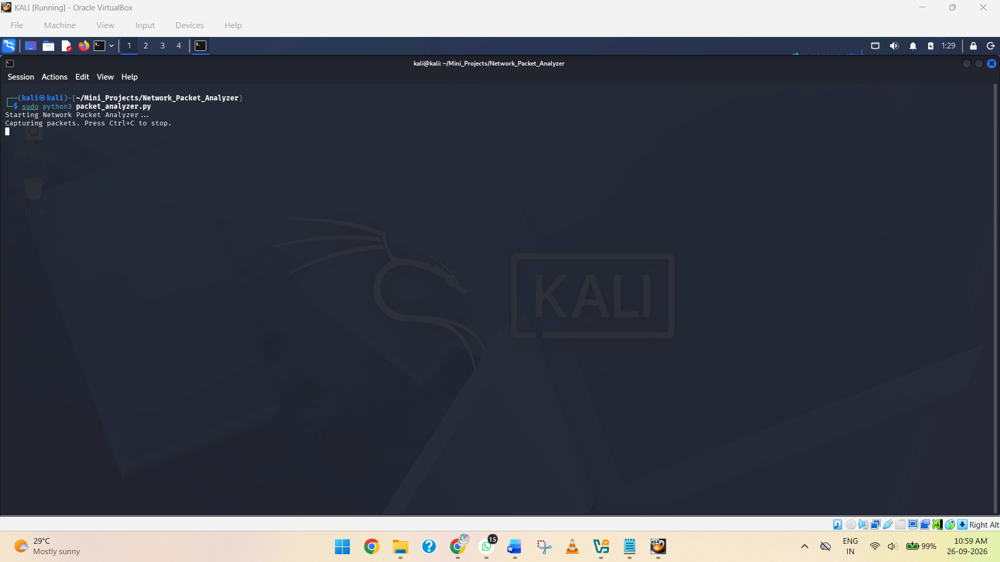

*Screenshot 16: Terminal showing the Network Packet Analyzer running and waiting for packets.*

#### 2. Generate TCP Traffic

Open a **second terminal** and run:

```bash
curl https://example.com
```

This generates TCP traffic to the web server.

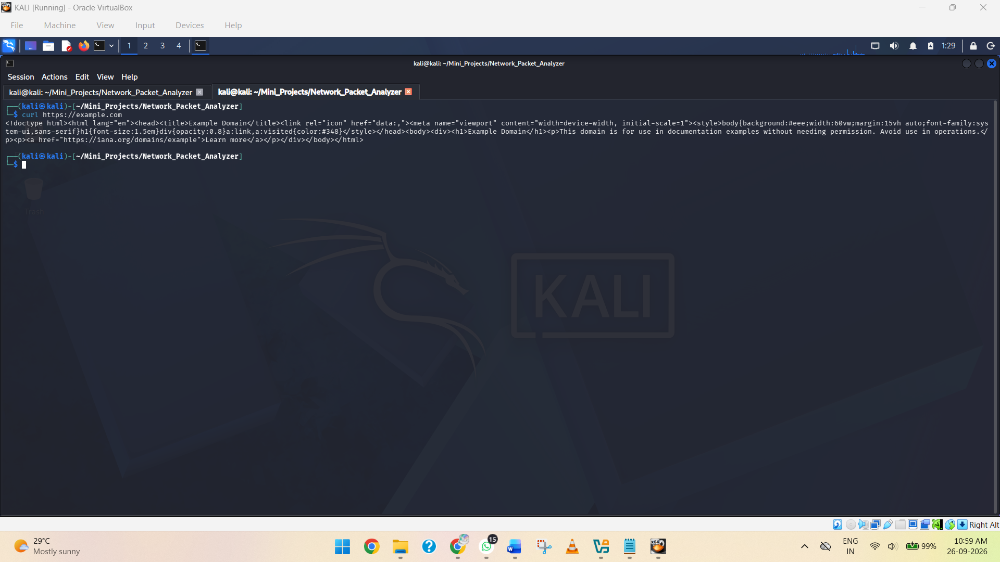

*Screenshot 17: Terminal showing the `curl` command.*

Return to the packet analyzer terminal. You should see information similar to:

```text
--- Packet Captured ---

Source IP      : 192.168.x.x
Destination IP : xxx.xxx.xxx.xxx
Protocol       : 6
Source Port    : 54321
Destination Port: 443
```

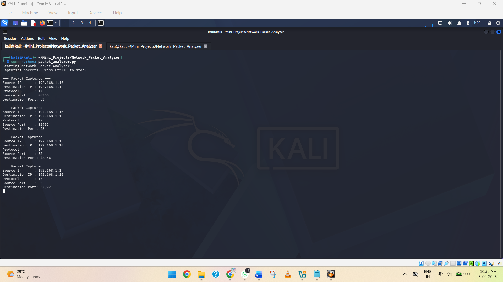

*Screenshot 18: Packet analyzer displaying a captured TCP packet with source and destination ports.*

#### 3. Generate UDP Traffic

In the second terminal, run:

```bash
nslookup example.com
```

This normally generates DNS traffic using UDP.

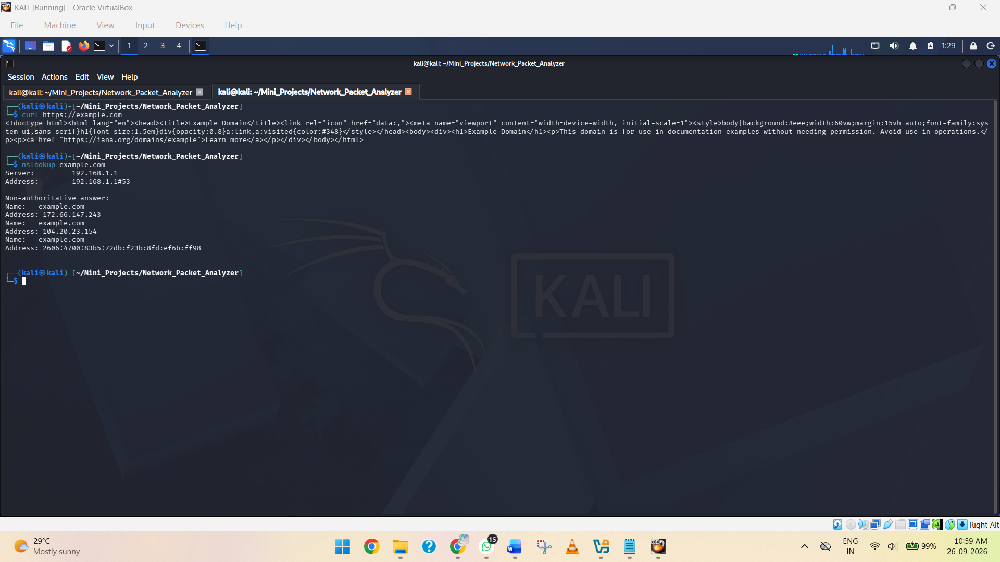

*Screenshot 19: Terminal showing the `nslookup` command.*

The analyzer may display something similar to:

```text
--- Packet Captured ---

Source IP      : 192.168.x.x
Destination IP : xxx.xxx.xxx.xxx
Protocol       : 17
Source Port    : 54321
Destination Port: 53
```


*Screenshot 20: Packet analyzer displaying a captured UDP/DNS packet with source and destination ports.*

#### 4. Stop the Analyzer

Return to the packet analyzer terminal and press:

```text
Ctrl + C
```

#### Protocol Numbers

For reference:

| Protocol | IP Protocol Number |
| -------- | -----------------: |
| ICMP     |                  1 |
| TCP      |                  6 |
| UDP      |                 17 |

The exact IP addresses and source ports will vary depending on your network connection and generated traffic.

### Step 9 — Add Payload Data Analysis

#### Objective

Enhance the **Network Packet Analyzer** to display basic **payload data** from captured packets. This allows the analyzer to provide additional information about the contents carried by network packets.

> **Note:** Payload data can contain sensitive information. Only inspect traffic on systems and networks where you have authorization.

#### 1. Open the Python File

Run:

```bash
nano ~/Mini_Projects/Network_Packet_Analyzer/packet_analyzer.py
```

#### 2. Replace the Existing Code

Replace the existing code with:

```python
from scapy.all import sniff, IP, TCP, UDP, Raw


def analyze_packet(packet):

    if IP in packet:
        source_ip = packet[IP].src
        destination_ip = packet[IP].dst
        protocol = packet[IP].proto

        print("\n--- Packet Captured ---")
        print(f"Source IP       : {source_ip}")
        print(f"Destination IP  : {destination_ip}")
        print(f"Protocol        : {protocol}")

        if TCP in packet:
            print(f"Source Port     : {packet[TCP].sport}")
            print(f"Destination Port: {packet[TCP].dport}")

        elif UDP in packet:
            print(f"Source Port     : {packet[UDP].sport}")
            print(f"Destination Port: {packet[UDP].dport}")

        if Raw in packet:
            payload = bytes(packet[Raw].load)
            print(f"Payload Length  : {len(payload)} bytes")
            print(f"Payload Data    : {payload[:100]!r}")

        else:
            print("Payload Data    : No payload")


print("Starting Network Packet Analyzer...")
print("Capturing packets. Press Ctrl+C to stop.")

sniff(prn=analyze_packet, store=False)
```

#### 3. Save the File

In Nano:

1. Press **Ctrl + O**
2. Press **Enter**
3. Press **Ctrl + X**

*Screenshot 21: Nano editor showing the updated packet analyzer code with payload analysis.*

#### What Was Added

The program now checks whether a captured packet contains a **Raw** layer.

If payload data is present, it displays:

* **Payload length**
* The first **100 bytes** of the payload

If no payload is present, it displays:

```text
Payload Data    : No payload
```

Limiting the output to the first 100 bytes keeps the terminal readable and prevents large packet contents from flooding the screen.

### Step 10 — Test Payload Data Analysis

#### Objective

Run the updated **Network Packet Analyzer** and verify that it can identify whether captured packets contain payload data and display the payload length and a limited portion of the payload.

#### 1. Start the Packet Analyzer

Open the project directory:

```bash
cd ~/Mini_Projects/Network_Packet_Analyzer
```

Run the program:

```bash
sudo python3 packet_analyzer.py
```

You should see:

```text
Starting Network Packet Analyzer...
Capturing packets. Press Ctrl+C to stop.
```

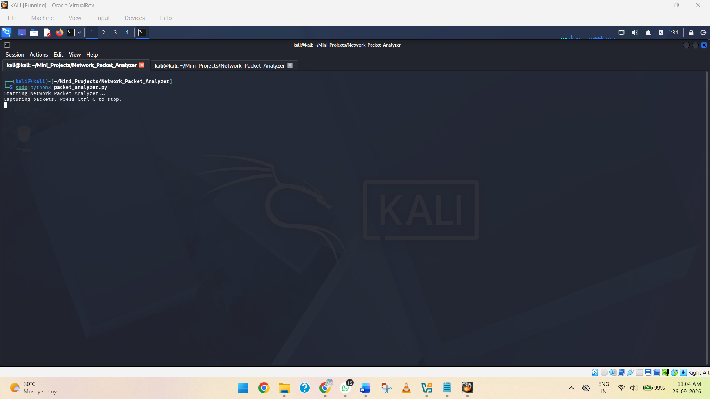

*Screenshot 22: Terminal showing the Network Packet Analyzer running with payload analysis enabled.*

#### 2. Generate Network Traffic

Open a second terminal and run:

```bash
curl https://example.com
```

This generates network traffic that the analyzer can inspect.

Return to the analyzer terminal.

You may see output similar to:

```text
Payload Data    : No payload
```

The actual IP addresses, ports, payload length, and payload contents will vary.


*Screenshot 23: Terminal showing packet analysis where no Raw payload is detected.*

#### 3. Test a Packet Without Payload

Generate another type of traffic, such as:

```bash
ping -c 4 8.8.8.8
```

The analyzer should capture ICMP packets. Depending on the packet structure, you may see:

```text
--- Packet Captured ---

Source IP       : 192.168.x.x
Destination IP  : xxx.xxx.xxx.xxx
Protocol        : 6
Source Port     : 54321
Destination Port: 443
Payload Length  : 100 bytes
Payload Data    : b'...'
```

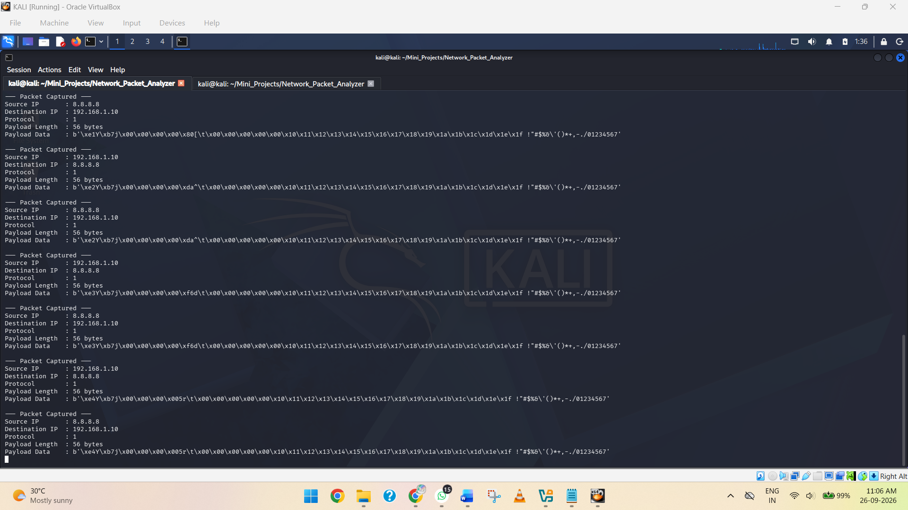

*Screenshot 24: Terminal showing a captured packet with payload length and payload data.*

#### 4. Stop the Analyzer

Press:

```text
Ctrl + C
```

#### Result

At this stage, the analyzer can display:

* **Source IP address**
* **Destination IP address**
* **Protocol number**
* **Source port**
* **Destination port**
* **Payload length**
* **Limited payload data**

Next, packet numbering and timestamp information can be added to make the analyzer output more useful for security monitoring.

---

### Step 11 — Add Packet Numbering and Timestamp

#### Objective

Improve the **Network Packet Analyzer** by assigning a **packet number** and recording the **timestamp** for each captured packet. This makes the output easier to read and useful for basic network traffic analysis.

#### 1. Open the Python File

Run:

```bash
nano ~/Mini_Projects/Network_Packet_Analyzer/packet_analyzer.py
```

#### 2. Replace the Existing Code

Replace the existing code with:

```python
from scapy.all import sniff, IP, TCP, UDP, Raw
from datetime import datetime


packet_count = 0


def analyze_packet(packet):

    global packet_count
    packet_count += 1

    timestamp = datetime.now().strftime("%Y-%m-%d %H:%M:%S")

    if IP in packet:
        source_ip = packet[IP].src
        destination_ip = packet[IP].dst
        protocol = packet[IP].proto

        print("\n--- Packet Captured ---")
        print(f"Packet Number   : {packet_count}")
        print(f"Timestamp       : {timestamp}")
        print(f"Source IP       : {source_ip}")
        print(f"Destination IP  : {destination_ip}")
        print(f"Protocol        : {protocol}")

        if TCP in packet:
            print(f"Source Port     : {packet[TCP].sport}")
            print(f"Destination Port: {packet[TCP].dport}")

        elif UDP in packet:
            print(f"Source Port     : {packet[UDP].sport}")
            print(f"Destination Port: {packet[UDP].dport}")

        if Raw in packet:
            payload = bytes(packet[Raw].load)
            print(f"Payload Length  : {len(payload)} bytes")
            print(f"Payload Data    : {payload[:100]!r}")

        else:
            print("Payload Data    : No payload")


print("Starting Network Packet Analyzer...")
print("Capturing packets. Press Ctrl+C to stop.")

sniff(prn=analyze_packet, store=False)
```

#### 3. Save the File

In Nano:

1. Press **Ctrl + O**
2. Press **Enter**
3. Press **Ctrl + X**

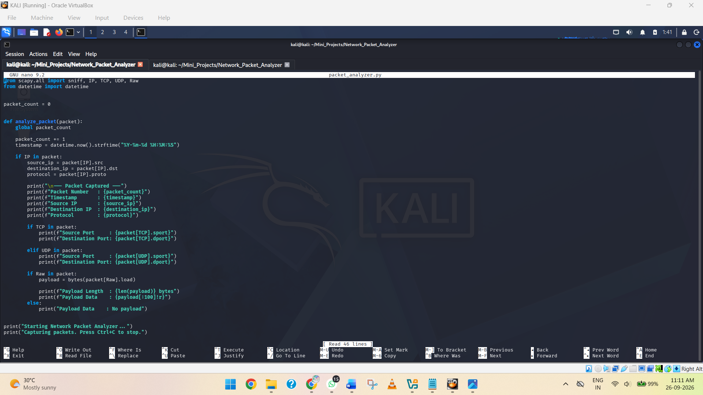

*Screenshot 25: Nano editor showing the updated packet analyzer code with packet numbering and timestamp functionality.*

#### What Was Added

The program now records:

* **Packet Number** — identifies each captured packet sequentially.
* **Timestamp** — records when the packet was processed.
* **Source IP**
* **Destination IP**
* **Protocol**
* **Source and destination ports**
* **Payload information**

For example:

```text
--- Packet Captured ---

Packet Number   : 1
Timestamp       : 2026-09-26 10:45:21
Source IP       : 192.168.1.10
Destination IP  : 8.8.8.8
Protocol        : 1
Payload Length  : 32 bytes
```

The packet number starts at **1** each time the program is started and increases for every IP packet processed.

### Step 12 — Test Packet Numbering and Timestamp

#### Objective

Run the updated **Network Packet Analyzer** and verify that each captured packet displays a **packet number** and **timestamp** along with the previously implemented network information.

#### 1. Start the Packet Analyzer

Open the project directory:

```bash
cd ~/Mini_Projects/Network_Packet_Analyzer
```

Run:

```bash
sudo python3 packet_analyzer.py
```

The terminal should display:

```text
Starting Network Packet Analyzer...
Capturing packets. Press Ctrl+C to stop.
```

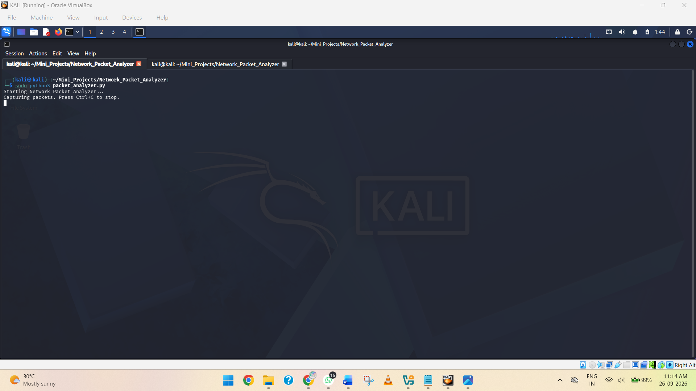

*Screenshot 26: Terminal showing the Network Packet Analyzer running.*

#### 2. Generate Network Traffic

Open a second terminal and run:

```bash
ping -c 4 8.8.8.8
```

The analyzer should capture the ICMP packets.

You should see output similar to:

```text
--- Packet Captured ---

Packet Number   : 1
Timestamp       : 2026-09-26 10:50:21
Source IP       : 192.168.x.x
Destination IP  : 8.8.8.8
Protocol        : 1
Payload Length  : 32 bytes
Payload Data    : b'...'
```

Additional packets should have increasing packet numbers:

```text
Packet Number   : 2
Packet Number   : 3
Packet Number   : 4
```

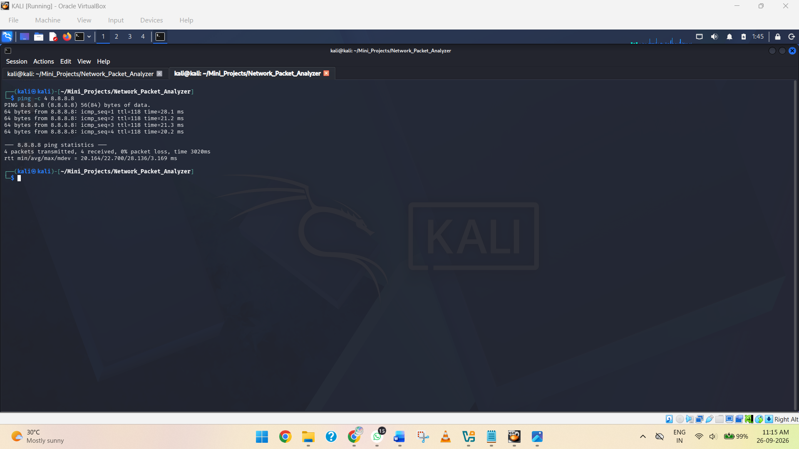

*Screenshot 27: Terminal showing captured packets with packet numbers and timestamps.*

#### 3. Generate Additional Traffic

In the second terminal, run:

```bash
curl https://example.com
```

This allows the analyzer to capture additional TCP traffic.

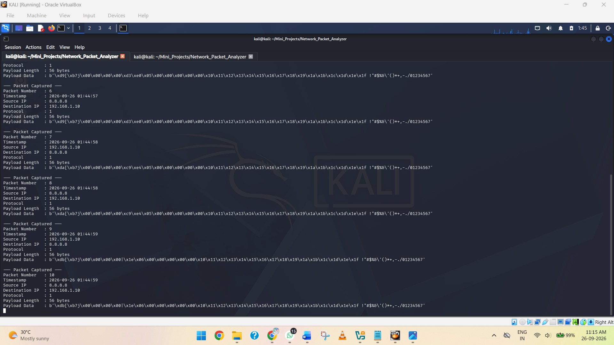

*Screenshot 28: Terminal showing additional captured TCP traffic with packet numbers, timestamps, IP addresses, and port information.*

#### 4. Stop the Analyzer

Return to the analyzer terminal and press:

```text
Ctrl + C
```

#### Expected Result

The analyzer should now provide a structured view of captured packets containing:

* **Packet Number**
* **Timestamp**
* **Source IP**
* **Destination IP**
* **Protocol**
* **Source Port**
* **Destination Port**
* **Payload Length**
* **Payload Data**

