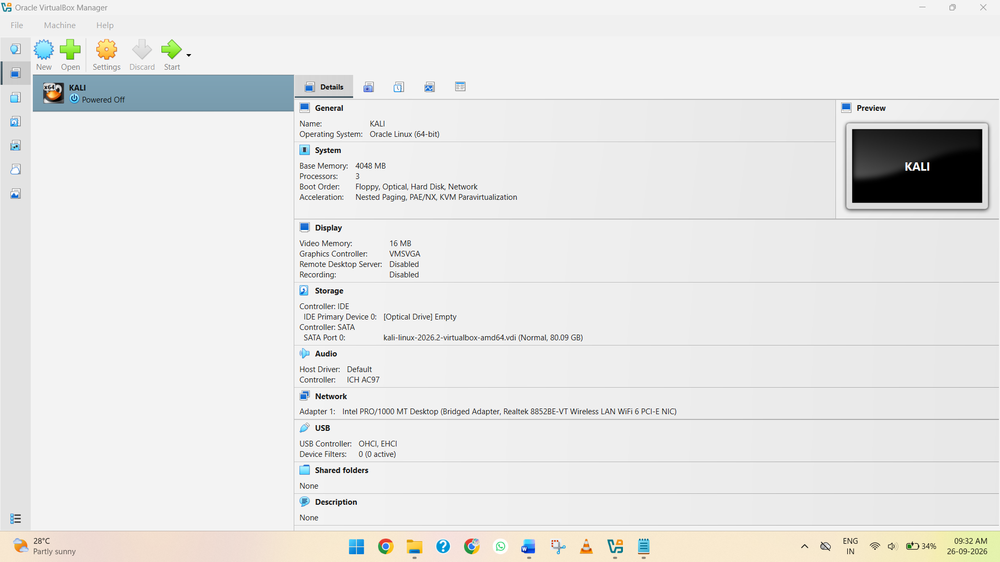
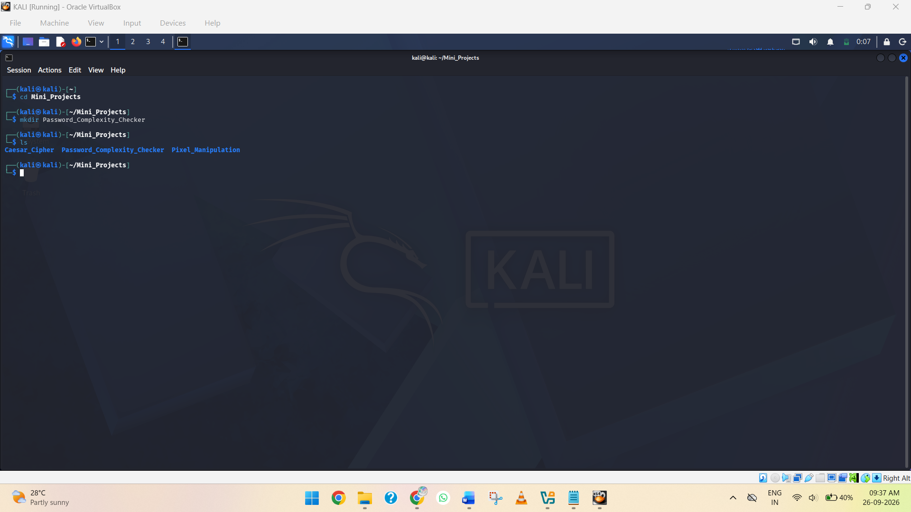
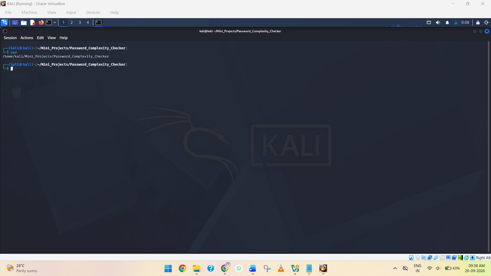
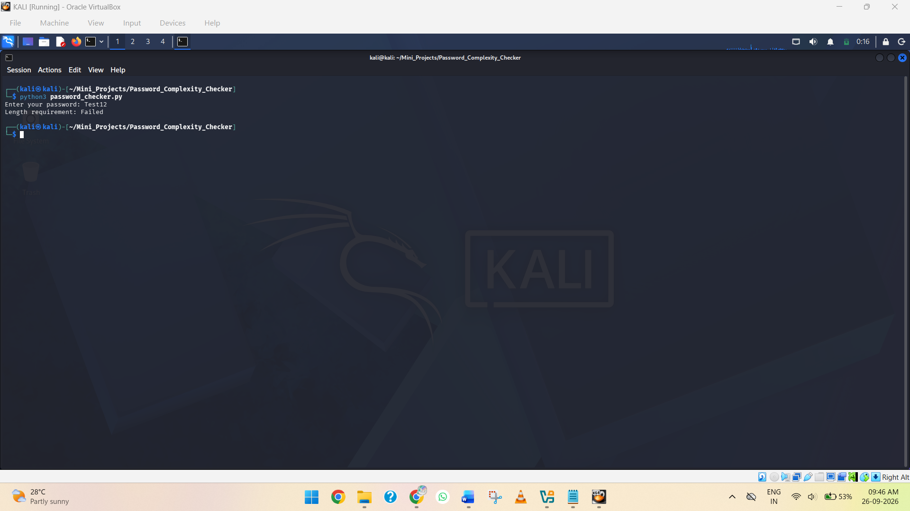
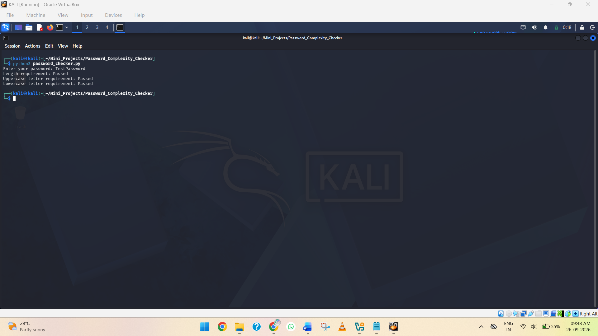
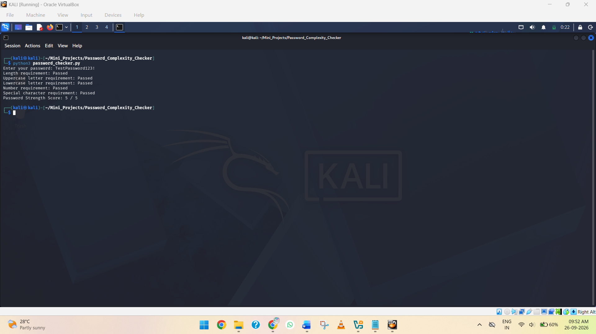

# Password Complexity Checker

## 📖 Project Overview

The **Password Complexity Checker** project is a Python-based application designed to evaluate the strength and complexity of a user-provided password. The program analyzes the password based on common security requirements such as length, uppercase letters, lowercase letters, numbers, and special characters.

The application checks the password against multiple complexity criteria and provides feedback about whether the password meets the required security conditions. It also helps identify missing character types so that users can understand how to improve their password strength.

This project demonstrates the practical use of **Python string handling, conditional statements, character validation, and basic cybersecurity concepts**. It provides a simple introduction to password security and the importance of creating strong and complex passwords.

## Step 1 — Create the Project Directory

### Objective

Create a dedicated directory for the **Password Complexity Checker** project and navigate into it.

### 1. Open Kali Linux

Start the **Kali Linux virtual machine** in VirtualBox and log in to the system.



*Screenshot 1: Kali Linux running in VirtualBox.*

### 2. Open the Kali Linux Terminal

Run the following command:

```bash
mkdir Password_Complexity_Checker
```

This creates a new project directory in the current home directory.



*Screenshot 2: Showing the new folder created.*

### 3. Navigate into the Project Directory

Run:

```bash
cd Password_Complexity_Checker
ls
```

The `cd` command navigates into the newly created project directory, while the `ls` command displays its contents.

### 4. Verify the Current Directory

Run:

```bash
pwd
```

You should see a path similar to:

```text
/home/kali/Mini_Projects/Password_Complexity_Checker
```

The `pwd` command confirms the current working directory.



*Screenshot 3: Showing the current directory.*

## Step 2 — Create the Python File

### Objective

Create the Python source file that will contain the **Password Complexity Checker** program.

### 1. Navigate to the Project Directory

Make sure you are inside the **Password Complexity Checker** project directory.

### 2. Create the Python File

Run:

```bash
touch password_checker.py
```

This creates an empty Python file named `password_checker.py`.

### 3. Verify the Python File

Run:

```bash
ls
```

You should see:

```text
password_checker.py
```


*Screenshot 4: Terminal showing the creation of `password_checker.py` and the `ls` command displaying the newly created Python file.*

## Step 3 — Take Password Input from the User

### Objective

Modify the Python program to accept a password from the user instead of using a hard-coded password.

### 1. Open the Python File

From inside the project directory, run:

```bash
nano password_checker.py
```

### 2. Add the Following Code

Enter the following Python code:

```python
password = input("Enter your password: ")

print("Password received successfully.")
```

The `input()` function allows the user to enter a password through the terminal.


*Screenshot 5: Nano editor showing the Python code.*

### 3. Save the File

In Nano:

* Press **Ctrl + O** to save the file.
* Press **Enter** to confirm the filename.
* Press **Ctrl + X** to exit Nano.

### 4. Run the Python Program

Run:

```bash
python3 password_checker.py
```

The program will display:

```text
Enter your password:
```

Enter a test password, for example:

```text
TestPassword123!
```

You should then see:

```text
Password received successfully.
```


*Screenshot 6: Terminal showing the Python program asking the user to enter a password and displaying **“Password received successfully.”***

## Step 4 — Check Password Length

### Objective

Add a password length check to determine whether the entered password meets the minimum required length.

For this project, we will consider a password to meet the length requirement when it contains **at least 8 characters**.

### 1. Open the Python File

From inside the project directory, run:

```bash
nano password_checker.py
```

### 2. Replace the Existing Code

Replace the existing code with:

```python
password = input("Enter your password: ")

if len(password) >= 8:
    print("Length requirement: Passed")
else:
    print("Length requirement: Failed")
```

The `len()` function counts the number of characters in the password.

### 3. Save the File

In Nano:

* Press **Ctrl + O** to save the file.
* Press **Enter** to confirm the filename.
* Press **Ctrl + X** to exit Nano.

### 4. Run the Python Program

Run:

```bash
python3 password_checker.py
```

Test it with a password containing at least 8 characters:

```text
Enter your password: TestPassword123!

Length requirement: Passed
```


*Screenshot 7: Terminal showing the Password Complexity Checker accepting a password and displaying the **Length requirement: Passed** result.*

You can also test a shorter password:

```text
Enter your password: Test12

Length requirement: Failed
```



*Screenshot 8: Terminal showing the Password Complexity Checker rejecting a password and displaying the **Length requirement: Failed** result.*

Next, we will add checks for **uppercase and lowercase letters**.

## Step 5 — Check for Uppercase and Lowercase Letters

### Objective

Add checks to determine whether the password contains both **uppercase** and **lowercase letters**.

### 1. Open the Python File

From inside the project directory, run:

```bash id="qv5g9u"
nano password_checker.py
```

### 2. Replace the Existing Code

Replace the existing code with:

```python id="yq2z1r"
password = input("Enter your password: ")

if len(password) >= 8:
    print("Length requirement: Passed")
else:
    print("Length requirement: Failed")

if any(char.isupper() for char in password):
    print("Uppercase letter requirement: Passed")
else:
    print("Uppercase letter requirement: Failed")

if any(char.islower() for char in password):
    print("Lowercase letter requirement: Passed")
else:
    print("Lowercase letter requirement: Failed")
```

The `isupper()` function checks whether a character is an uppercase letter, while `islower()` checks whether a character is a lowercase letter. The `any()` function determines whether at least one matching character exists in the password.

### 3. Save the File

In Nano:

* Press **Ctrl + O** to save the file.
* Press **Enter** to confirm the filename.
* Press **Ctrl + X** to exit Nano.

### 4. Run the Python Program

Run:

```bash id="n5o6wl"
python3 password_checker.py
```

Test it with:

```text id="qg3z1m"
Enter your password: TestPassword

Length requirement: Passed
Uppercase letter requirement: Passed
Lowercase letter requirement: Passed
```



*Screenshot 9: Terminal showing the Password Complexity Checker testing a password and displaying the **length, uppercase, and lowercase requirements**.*

## Step 6 — Check for Numbers and Special Characters

### Objective

Add checks to determine whether the password contains at least one **number** and one **special character**.

### 1. Open the Python File

From inside the project directory, run:

```bash id="s0l8ec"
nano password_checker.py
```

### 2. Replace the Existing Code

Replace the existing code with:

```python id="r9rj6k"
password = input("Enter your password: ")

if len(password) >= 8:
    print("Length requirement: Passed")
else:
    print("Length requirement: Failed")

if any(char.isupper() for char in password):
    print("Uppercase letter requirement: Passed")
else:
    print("Uppercase letter requirement: Failed")

if any(char.islower() for char in password):
    print("Lowercase letter requirement: Passed")
else:
    print("Lowercase letter requirement: Failed")

if any(char.isdigit() for char in password):
    print("Number requirement: Passed")
else:
    print("Number requirement: Failed")

if any(not char.isalnum() for char in password):
    print("Special character requirement: Passed")
else:
    print("Special character requirement: Failed")
```

The `isdigit()` function checks for numbers. The `isalnum()` function identifies letters and numbers, so `not char.isalnum()` allows the program to detect special characters such as `!`, `@`, `#`, and `$`.

### 3. Save the File

In Nano:

* Press **Ctrl + O** to save the file.
* Press **Enter** to confirm the filename.
* Press **Ctrl + X** to exit Nano.

### 4. Run the Python Program

Run:

```bash id="4v6qrf"
python3 password_checker.py
```

Test it with:

```text id="c4qz9b"
Enter your password: TestPassword123!

Length requirement: Passed
Uppercase letter requirement: Passed
Lowercase letter requirement: Passed
Number requirement: Passed
Special character requirement: Passed
```


*Screenshot 10: Terminal showing the Password Complexity Checker testing a password and displaying the **length, uppercase, lowercase, number, and special character requirements**.*

## Step 7 — Calculate the Password Strength Score

### Objective

Combine the password complexity checks into a **strength score**. Each requirement that is successfully satisfied will add one point to the total score.

The five criteria are:

1. Minimum length of 8 characters
2. Uppercase letter
3. Lowercase letter
4. Number
5. Special character

### 1. Open the Python File

From inside the project directory, run:

```bash
nano password_checker.py
```

### 2. Replace the Existing Code

Replace the existing code with:

```python
password = input("Enter your password: ")

score = 0

if len(password) >= 8:
    print("Length requirement: Passed")
    score += 1
else:
    print("Length requirement: Failed")

if any(char.isupper() for char in password):
    print("Uppercase letter requirement: Passed")
    score += 1
else:
    print("Uppercase letter requirement: Failed")

if any(char.islower() for char in password):
    print("Lowercase letter requirement: Passed")
    score += 1
else:
    print("Lowercase letter requirement: Failed")

if any(char.isdigit() for char in password):
    print("Number requirement: Passed")
    score += 1
else:
    print("Number requirement: Failed")

if any(not char.isalnum() for char in password):
    print("Special character requirement: Passed")
    score += 1
else:
    print("Special character requirement: Failed")

print("Password Strength Score:", score, "/ 5")
```

### 3. Save the File

In Nano:

* Press **Ctrl + O** to save the file.
* Press **Enter** to confirm the filename.
* Press **Ctrl + X** to exit Nano.

### 4. Run the Python Program

Run:

```bash
python3 password_checker.py
```

Test it with:

```text
Enter your password: TestPassword123!

Length requirement: Passed
Uppercase letter requirement: Passed
Lowercase letter requirement: Passed
Number requirement: Passed
Special character requirement: Passed
Password Strength Score: 5 / 5
```

The `score` variable starts at `0`. Each time a password requirement is satisfied, `score += 1` increases the score by one.



*Screenshot 11: Terminal showing the Password Complexity Checker testing a password and displaying the individual requirements along with the final **Password Strength Score: 5 / 5**.*
